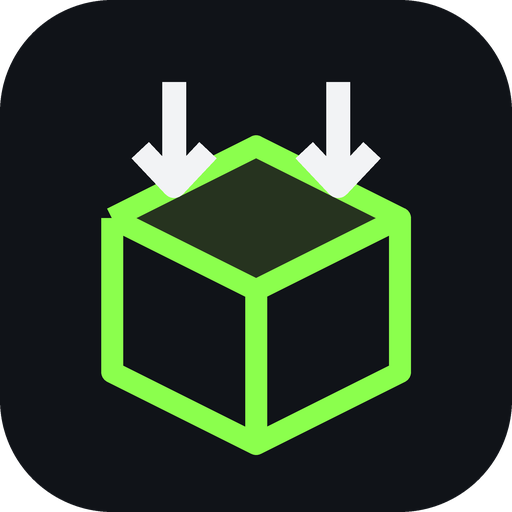

<p align="center">
  
</p>

<h1 align="center">vKOROBKU</h1>

<p align="center">
  Сжатие игр штатными средствами Windows для экономии места на диске.
</p>

<p align="center">
  <a href="https://github.com/damnpotato430-eng/vkorobku/releases/tag/v0.1.2"></a>
  
  <a href="LICENSE"></a>
</p>

Игровое Windows-приложение для оценки и прозрачного сжатия установленных игр алгоритмами XPRESS и LZX.

> Проект находится на ранней стадии. Приложение обнаруживает игры, рассчитывает экономию на безопасной временной выборке и выполняет прозрачное сжатие или распаковку через отдельный UAC-worker.

## Скачать

### [Скачать vKOROBKU v0.1.2 для Windows x64](https://github.com/damnpotato430-eng/vkorobku/releases/tag/v0.1.2)

Рекомендуется скачивать архив `vKOROBKU-v0.1.2-win-x64.zip`, полностью распаковать его и запустить `vKOROBKU.exe`. Файл `vKOROBKU.Worker.exe` должен находиться рядом.

Релиз является self-contained: устанавливать .NET Runtime отдельно не требуется.

> Это предварительная тестовая версия. Начинайте с игр, которые можно восстановить через проверку файлов Steam.

## Целевая платформа

- Windows 10/11 x64
- NTFS для операций XPRESS/LZX

## Возможности MVP

- автоматический поиск игр Steam;
- ручное добавление папки с сохранением, автоматическим определением игры и возможностью уточнить название;
- автоматические обложки Steam, резервный поиск в IGDB, локальный кэш и защищённые DPAPI ключи;
- определение CPU, RAM, дисков и файловой системы;
- автоматический подбор XPRESS4K/8K/16K или LZX одной кнопкой;
- предварительная оценка по настраиваемой выборке 512 МБ, 1 ГБ или 2 ГБ и сохранение результатов между запусками — реализовано;
- локальный бенчмарк чтения без системного кэша и оценка влияния на загрузки — реализовано;
- определение уже сжатых игр через WOF/NTFS, сохранение их статуса;
- простой сценарий «выбрать игру → оптимизировать»;
- необязательный экспертный режим с ручным выбором точности и XPRESS/LZX;
- сжатие, отмена и полная распаковка;
- запрос прав администратора только для защищённых каталогов и системных операций.

## Разработка

Требуется .NET 8 SDK с Windows Desktop workload.

```powershell
dotnet restore
dotnet build vKOROBKU.sln
dotnet run --project src/vKOROBKU.App
```

Проект проверен сборкой с .NET SDK 8.0.422.

Подробности: [спецификация MVP](docs/MVP.md), [архитектура](docs/ARCHITECTURE.md) и [настройка IGDB](docs/IGDB.md).

## Лицензия

GNU General Public License v3.0. См. [LICENSE](LICENSE).
