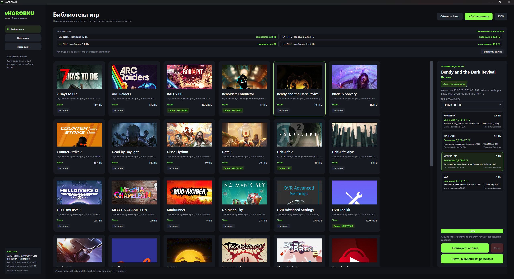

<p align="center">
  
</p>

<h1 align="center">vKOROBKU</h1>

<p align="center">
  Сжатие игр штатными средствами Windows для экономии места на диске.
</p>

<p align="center">
  <a href="https://github.com/damnpotato430-eng/vkorobku/actions/workflows/build.yml"></a>
  <a href="https://github.com/damnpotato430-eng/vkorobku/releases/latest"></a>
  
  <a href="LICENSE"></a>
</p>

Игровое Windows-приложение для оценки и прозрачного сжатия установленных игр алгоритмами XPRESS и LZX. Игры продолжают работать как раньше — меняется только способ хранения файлов на NTFS.

<p align="center">
  
</p>

> Предварительная версия: ядро работает и проверено на реальных библиотеках, продолжается полевое тестирование. Начинайте с игр, которые можно восстановить через проверку файлов Steam.

## Скачать

### [Скачать последнюю версию vKOROBKU для Windows x64](https://github.com/damnpotato430-eng/vkorobku/releases/latest)

Рекомендуется скачивать архив `vKOROBKU-v<версия>-win-x64.zip`, полностью распаковать его и запустить `vKOROBKU.exe`. Файл `vKOROBKU.Worker.exe` должен находиться рядом.

Релиз является self-contained: устанавливать .NET Runtime отдельно не требуется. Релизы собираются автоматически из тегов через GitHub Actions.

## Целевая платформа

- Windows 10/11 x64
- NTFS для операций XPRESS/LZX

## Возможности

**Анализ и сжатие**

- автоматический поиск игр Steam, Epic Games Store и GOG, а также Ubisoft Connect и EA App (экспериментально — на живых установках пока не проверялось); ручное добавление папок с определением игры;
- предварительная оценка на безопасной выборке (512 МБ – 2 ГБ) с прогнозом для XPRESS4K/8K/16K и LZX и бенчмарком скорости чтения без системного кэша;
- автоматический выбор алгоритма с балансом «экономия ↔ скорость чтения»: программа не жертвует скоростью загрузок ради пары сотен мегабайт;
- сжатие, полная распаковка и отмена; прерванная операция продолжается с места остановки;
- кнопка «Дожать» для обновившихся игр — сжимает только новые файлы тем же алгоритмом;
- пропуск заведомо несжимаемых файлов (медиа, архивы — 41 тип, список настраивается): быстрее сжатие и точнее прогноз.

**Наблюдение и безопасность**

- наблюдение за сжатыми играми: при запуске приложение проверяет, не «расжались» ли игры после обновлений, и показывает, сколько места можно вернуть;
- определение DirectStorage-игр: сжатие для них не рекомендуется и блокируется (в экспертном режиме — после явного подтверждения);
- распознавание игр, сжатых ранее или сторонними инструментами, через WOF/NTFS;
- права администратора запрашиваются только для самой операции сжатия — интерфейс всегда работает без повышения прав;
- уведомление о выходе новой версии (без автоустановки).

**Интерфейс**

- сценарий «выбрать игру → Оптимизировать» одной кнопкой; необязательный экспертный режим с ручным выбором алгоритма и точности анализа;
- цветные статусы на карточках, экономия по каждому диску и суммарно;
- обложки Steam, в том числе для не-Steam игр по названию — без настройки и ключей; журнал операций и окно настроек.

## Разработка

Требуется .NET 8 SDK с Windows Desktop workload.

```powershell
dotnet restore
dotnet build vKOROBKU.sln
dotnet run --project src/vKOROBKU.App
```

Проект проверен сборкой с .NET SDK 8.0.422.

Подробности: [спецификация MVP](docs/MVP.md) и [архитектура](docs/ARCHITECTURE.md).

## Лицензия

GNU General Public License v3.0. См. [LICENSE](LICENSE).
