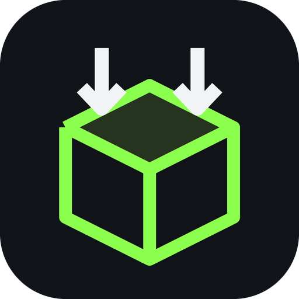
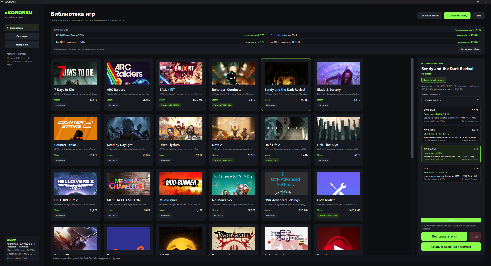

<p align="center">
  
</p>

<h1 align="center">vKOROBKU</h1>

<p align="center">
  Game compression with built-in Windows tools to save disk space.
</p>

<p align="center">
  <b>English</b> | <a href="README.ru.md">Русский</a>
</p>

<p align="center">
  <a href="#get-vkorobku">Get vKOROBKU</a> ·
  <a href="#features">Features</a> ·
  <a href="#build-from-source">Build from source</a> ·
  <a href="#license">License</a>
</p>

<p align="center">
  <a href="https://github.com/damnpotato430-eng/vkorobku/actions/workflows/build.yml"></a>
  
  <a href="LICENSE"></a>
</p>

A Windows application that estimates and transparently compresses installed games with the XPRESS and LZX algorithms. Games keep working as before — only the way their files are stored on NTFS changes.

<p align="center">
  
</p>

> Preview version: the core works and has been verified on real game libraries; field testing continues. Start with games you can restore through Steam file verification.

## Get vKOROBKU

**Ready-made build — on Steam** (coming soon). A ready build with automatic updates, and buying it supports the development of the project. The application stays open source either way — the Steam copy is convenience, not a different program.

**Free — build it yourself.** The full source is here under GPL-3.0; see [Build from source](#build-from-source). It takes three commands and gives you exactly the same application.

Prebuilt binaries are no longer published on GitHub — [older releases](https://github.com/damnpotato430-eng/vkorobku/releases) remain available but are not updated.

## Target platform

- Windows 10/11 x64
- NTFS for XPRESS/LZX operations

## Features

**Analysis and compression**

- automatic discovery of Steam, Epic Games Store and GOG games, plus Ubisoft Connect and EA App (experimental — not yet verified on live installations); manual folder adding with game detection;
- preliminary estimate on a safe sample (512 MB – 2 GB) with a forecast for XPRESS4K/8K/16K and LZX and a read-speed benchmark that bypasses the system cache;
- automatic algorithm choice balancing savings against read speed: the app never sacrifices loading times for a couple hundred megabytes;
- compression, full decompression and cancellation; an interrupted operation resumes where it stopped;
- a "finish" button for updated games — compresses only the new files with the same algorithm;
- skipping files that are known to be incompressible (media, archives — 41 types, configurable): faster compression and a more accurate forecast.

**Monitoring and safety**

- watching compressed games: on startup the app checks whether games "decompressed themselves" after updates and shows how much space can be reclaimed;
- DirectStorage detection: compression is discouraged and blocked for such games (available in expert mode after explicit confirmation);
- recognition of games compressed earlier or by third-party tools, via WOF/NTFS;
- administrator rights are requested only for the compression operation itself — the UI always runs unelevated;
- new-version notification (no auto-install).

**Interface**

- the "pick a game → Optimize" one-button flow; an optional expert mode with manual algorithm and analysis-precision selection;
- colored card statuses, savings per drive and in total;
- Steam covers, including for non-Steam games matched by name — no setup or API keys; an operations journal and a settings window.

## Build from source

Requires the [.NET 10 SDK](https://dotnet.microsoft.com/download/dotnet/10.0) with the Windows Desktop workload.

```powershell
git clone https://github.com/damnpotato430-eng/vkorobku.git
cd vkorobku
dotnet build vKOROBKU.sln -c Release
```

Then run `src\vKOROBKU.App\bin\Release\net10.0-windows10.0.19041.0\vKOROBKU.exe`. Keep `vKOROBKU.Worker.exe` next to it — the app launches it for elevated operations.

For a self-contained package identical to the Steam build, run `scripts\build-release.ps1`.

The project is verified to build with .NET SDK 10.0.302.

Details: [MVP specification](docs/MVP.md) and [architecture](docs/ARCHITECTURE.md) (in Russian).

## License

GNU General Public License v3.0. See [LICENSE](LICENSE).
